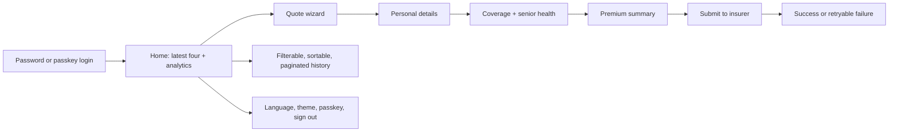

# Clara Insurance Quotes · Web


Clara is a premium, mobile-first insurance quote web app. The UI guides a
customer from sign-in through personal details, coverage and senior health
questions, premium calculation, submission, retry, and quote history.

The frontend uses a capability-first structure, typed private localization
catalogs, TanStack Query for server state, same-origin /api traffic, and
Playwright journeys against the real JVM backend.

> **Full-stack partner:** [insurance-quotes-service](../insurance-quotes-service)

## Product flow



## Why this stack and structure

| Choice                            | Why it fits the product                                                                                                                                                                                              |
| --------------------------------- | -------------------------------------------------------------------------------------------------------------------------------------------------------------------------------------------------------------------- |
| React + TypeScript                | Component composition suits a guided wizard and TypeScript keeps API, state, and UI contracts explicit.                                                                                                              |
| Feature-Sliced Design (FSD)       | `features` own user capabilities, `app` owns composition/routing, and `shared` contains genuinely reusable primitives; changes stay close to the behavior they affect.                                               |
| Separate workspace packages       | `api-contract` is generated from OpenAPI to detect frontend/backend drift; `app-i18n` owns catalogs and selectors privately; build configuration stays reusable and small.                                           |
| `t()` + `tid()`                   | Localized copy and automation selectors have different lifecycles. `t()` returns language-specific text; typed `tid()` returns stable test IDs, including for textless controls, without exposing catalog internals. |
| TanStack Query                    | Server state, caching, invalidation, pagination, and retry behavior belong in one purpose-built layer; React context remains focused on auth and wizard state.                                                       |
| Vite + Bun                        | Vite gives fast HMR and Bun keeps workspace installation and scripts quick and reproducible.                                                                                                                         |
| Same-origin `/api` BFF            | Vite and Nginx proxy browser requests through one origin, avoiding browser CORS and keeping insurer/API topology private.                                                                                            |
| MUI + responsive shell            | Accessible, composable primitives provide a consistent premium UI across fixed desktop navigation and mobile bottom navigation.                                                                                      |
| Playwright against the real stack | End-to-end tests start the real JVM API, proxy, database dependencies, and insurer stub, proving integration rather than only mocked screens.                                                                        |
| PWA boundaries                    | Static assets can be installable and resilient offline without caching tokens, mutable quote data, or API responses.                                                                                                 |

The result is app-like UX with enterprise boundaries: local feature ownership,
typed contracts, stable automation, and a deployment path that mirrors local
development.

## Quick start

### Prerequisites

- Bun 1.3.13
- Mise (used by the documented setup and development commands)
- Node-compatible shell utilities
- Docker and the sibling backend for real API journeys

Expected layout:

```text
workspace/
├── insurance-quotes-service/
└── insurance-quotes-web/
```

From the workspace root, follow the one-time trust preflight in
[`docs/setup-and-verification.md`](docs/setup-and-verification.md). Then run
these commands from this repository:

```bash
mise run setup
bun run dev                         # Vite HMR at http://localhost:5173
```

For reviewers, the backend repository provides the single-command integrated
demo. From `insurance-quotes-service`, run `mise run demo`; it installs both
workspaces and starts the browser-ready stack at http://localhost:3100.

Vite proxies same-origin /api/* requests to the backend at port 8080. The
production Nginx image uses the same /api boundary, so development and
deployment exercise the same browser contract without direct backend or
insurer calls from the browser.

For the integrated runtime:

```bash
cd ../insurance-quotes-service
mise run up jvm full e2e            # API :8080, Nginx :3100, WireMock :8089
cd ../insurance-quotes-web
E2E_BASE_URL=http://localhost:3100 bun run e2e -- --retries=0
```

## Application shell

After authentication:

| Route           | Experience                                                        |
| --------------- | ----------------------------------------------------------------- |
| /quotes         | Home dashboard with the latest four quotes and business analytics |
| /quotes/history | Full history with server-side pagination, filtering, and ordering |
| /quote/personal | New quote wizard                                                  |
| /account        | Language, theme, passkey/session status, and sign out             |

Desktop uses a fixed header and icon rail. Small devices use the fixed bottom
navigation and a safe-area-aware wizard action dock. The login route is kept
outside the authenticated shell and presents a focused single card.

## Localization and selectors

The private app-i18n package keeps its catalog implementation hidden:

```ts
t('wizard.coverage.title'); // visible localized text
tid('wizard.coverage.premiumLabel'); // typed stable selector
```

The browser detects en-US or es-MX, falls back to en-US for unsupported
preferences, and sends the selected locale as Accept-Language. Textless
elements can still expose a typed tid() selector.

## PWA and production image

```bash
bun run --filter web build
cd apps/web && node src/pwa/check-build.mjs
E2E_PWA_PREVIEW_PORT=43102 bun run --filter e2e test:pwa-preview
```

The Dockerfile builds the static app and serves it through Nginx. The service
worker precaches static assets only; it never caches auth tokens, /api
responses, or mutable quote data.

## Test matrix

### Fast quality gates

```bash
bun run test
bun run lint
bun run build
bun run format:check
```

### Real browser journeys

```bash
E2E_BASE_URL=http://localhost:3100 bun run e2e -- --retries=0
```

The suite covers:

- standard adult quote and successful submission;
- senior health flow with diabetes and hypertension pricing;
- deterministic insurer failure and retry;
- password login, passkey enrollment, MFA, and passwordless login;
- latest-four Home behavior and paginated history;
- fixed desktop/mobile shell, accessibility, no-overflow, and PWA preview.

### Flow recordings

Run the named demo videos against the real stack:

```bash
E2E_BASE_URL=http://localhost:3100 RECORD_DEMO=true \
  bun run --filter e2e test:recordings
```

The recording source and download instructions are in
[docs/demo-recordings.md](docs/demo-recordings.md). Videos are generated by
Playwright and uploaded by the regular full-stack workflow and the manual named
flow workflow; binaries are intentionally not committed. Use the stable
workflow links above to generate current artifacts; individual run links are
historical evidence.

## CI/CD

- [Frontend CI](.github/workflows/ci.yml) runs on pushes to `main` and on every
  pull request, cancelling superseded runs for the same branch:
  tests, lint, locale validation, formatting, build, PWA checks, image build,
  and responsive/accessible browser audits.
- [Full-stack real E2E](.github/workflows/full-stack-e2e.yml) builds the
  compatible JVM stack and runs real browser flows through same-origin Nginx.
- Full-stack E2E records the complete real Playwright suite by default and
  uploads its videos and reports; the manual recording workflow records the
  named demo journeys.
- Concurrency cancellation stops older in-progress runs when a newer commit
  arrives for the same branch or pull request.

The workflows validate deployable images and integration behavior. Cloud
deployment remains target-neutral until a registry, hosting provider, and
credentials are selected.

## Design boundaries

| Area                                       | Owner                 |
| ------------------------------------------ | --------------------- |
| Feature behavior                           | apps/web/src/features |
| Routes and providers                       | apps/web/src/app      |
| API client, theme, navigation, reusable UI | apps/web/src/shared   |
| Private text and selectors                 | packages/app-i18n     |
| Real browser support and journeys          | e2e                   |

React context owns authentication and local wizard state. TanStack Query owns
server cache and invalidation. The shared HTTP client attaches access tokens,
refreshes once when appropriate, sends API-version and locale headers, and
normalizes errors for visible UI alerts.

## Challenge map

| Requirement              | Frontend implementation                                              |
| ------------------------ | -------------------------------------------------------------------- |
| Clear quote journey      | Guided wizard with visible progress and recoverable states           |
| Senior health pricing    | Diabetes/hypertension controls and premium update                    |
| Authentication           | Password, passkey setup, MFA, passwordless recovery                  |
| Responsive UX            | Fixed desktop shell, mobile bottom navigation, safe-area action dock |
| Localization             | Browser detection, t() text, typed tid() selectors                   |
| Same-origin integration  | Vite/Nginx /api proxy                                                |
| Observability visibility | Home analytics and backend dashboard links                           |
| Quality evidence         | Unit tests, lint/build gates, real Playwright, recordings            |

## Troubleshooting

- **Port 3000 is occupied:** Clara’s integrated Nginx app uses port 3100.
- **API calls return 403 locally:** reset the local Redis rate-limit state or
  use the dev profile, then restart the current stack.
- **Passkey asks for a missing credential:** reset the backend E2E database or
  use a seeded account without a passkey.
- **Submit is slow:** ensure WireMock is running on port 8089; the browser
  should still call only same-origin /api.
- **PWA metadata check warns:** run the production build and inspect the
  generated manifest/service-worker artifacts separately from HMR.

## Architecture references

The backend ADR catalogue is in
[insurance-quotes-service/docs/decisions](../insurance-quotes-service/docs/decisions/README.md).
The full setup guide is [docs/setup-and-verification.md](docs/setup-and-verification.md).

## Contributing

Keep capability boundaries clear, preserve tid() selectors, add tests beside
behavior, and use real API journeys for cross-repository behavior. Use focused
conventional commits and update the demo gallery when a user-visible flow
changes.
