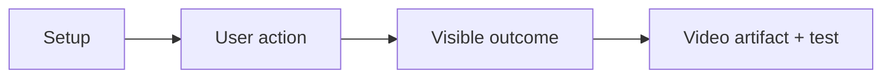

# Clara flow hyperframes

These recordings are produced by Playwright against the real same-origin web
and JVM API stack. Each scenario is a small visual story:



Run the local gallery suite:

```bash
E2E_BASE_URL=http://localhost:3100 bun run --filter e2e test:recordings
```

Or dispatch the `Full-stack real E2E` workflow with `record_demo=true`. The
latest verified artifact is
[clara-demo-recordings-30386095142](https://github.com/migangdelzar/insurance-quotes-web/actions/runs/30386095142),
which contains the six videos and the Playwright report. Videos and reports are
deliberately generated artifacts rather than large files committed to the
repository.

## 01 · Standard quote

| Setup           | Action                   | Outcome                                     |
| --------------- | ------------------------ | ------------------------------------------- |
| Sign in as demo | Choose standard coverage | Premium is shown and the quote is submitted |

**Test:** [01-standard-quote](../../e2e/tests/demo-recordings.spec.ts)

This is the baseline happy path: password login, personal details, coverage,
premium calculation, and successful insurer submission.

## 02 · Senior health quote

| Setup        | Action                           | Outcome                                     |
| ------------ | -------------------------------- | ------------------------------------------- |
| Enter age 70 | Select diabetes and hypertension | Health-aware premium is shown and submitted |

**Test:** [02-senior-health-quote](../../e2e/tests/demo-recordings.spec.ts)

The recording makes the conditional health section visible and demonstrates
that diabetes and hypertension are included in the final premium calculation.

## 03 · Submission retry

| Setup                | Action                                | Outcome                                               |
| -------------------- | ------------------------------------- | ----------------------------------------------------- |
| WireMock returns 500 | Press retry after the visible failure | The same quote succeeds after the insurer returns 200 |

**Test:** [03-submission-retry](../../e2e/tests/demo-recordings.spec.ts)

This is the recovery story: the browser receives a real API failure, the quote
remains resubmittable, and the second submission completes successfully.

## 04 · Passkey lifecycle

| Setup                                 | Action                                                     | Outcome                                 |
| ------------------------------------- | ---------------------------------------------------------- | --------------------------------------- |
| Enable Chromium virtual authenticator | Enroll, authenticate with MFA, then use passwordless login | The user reaches the authenticated Home |

**Test:** [04-passkey-lifecycle](../../e2e/tests/demo-recordings.spec.ts)

This recording uses the isolated `demo-three` seeded account so it can mutate
passkey state without changing the account used by the other stories.

## 05 · History and analytics

| Setup     | Action                                            | Outcome                                                       |
| --------- | ------------------------------------------------- | ------------------------------------------------------------- |
| Open Home | Create drafts, search, sort, and change page size | Latest-four analytics and full history controls remain usable |

**Test:** [05-history-and-analytics](../../e2e/tests/demo-recordings.spec.ts)

Home keeps the latest four quotes for a concise dashboard. The history route
uses the real API for filtering, ordering, and pagination.

## 06 · Observability and same-origin boundary

| Setup                 | Action                                                        | Outcome                                                             |
| --------------------- | ------------------------------------------------------------- | ------------------------------------------------------------------- |
| Sign in through Nginx | Load analytics, health, and Prometheus endpoints through /api | Browser requests stay same-origin and operational endpoints respond |

**Test:** [06-observability-and-same-origin](../../e2e/tests/demo-recordings.spec.ts)

The visible dashboard request and the health/Prometheus checks verify the
browser boundary. Prometheus is scraped by the observability stack; Kafka
continues to carry durable business events and is not used for metrics.

## Artifact review checklist

- [ ] Download the named Actions artifact.
- [ ] Open each video in chronological order.
- [ ] Confirm the URL remains the same-origin frontend URL.
- [ ] Confirm no browser console error appears except the deliberate retry
      diagnostic.
- [ ] Compare the visible outcome with the table above.
