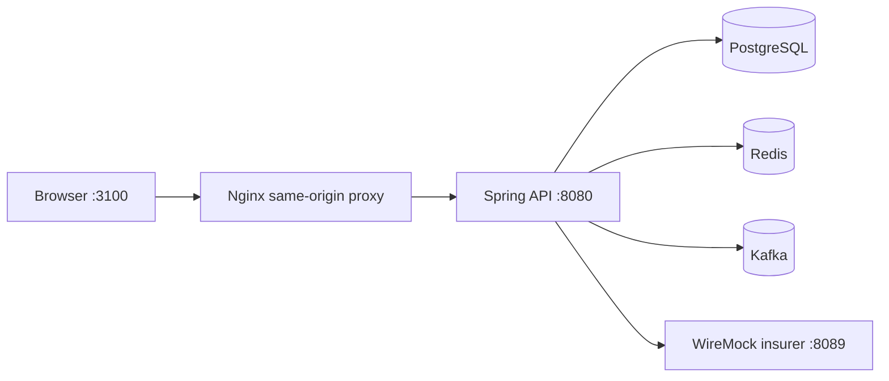

# Clara · Full-stack setup & verification

> **The shortest path to a working demo**
>
> Clone the two repositories side by side, install Docker and Mise, then run
> `mise run demo` from `insurance-quotes-service`. The command installs both
> workspaces, starts the real JVM stack, and prepares the browser-ready app.


This guide runs the real Clara application across the sibling repositories. The
browser talks to the frontend origin; Nginx or Vite proxies `/api/*` to the
Spring service, so Playwright verifies the same BFF boundary used by the app
without mocking API responses or bypassing the proxy.

## 1. One-command demo

### Repository layout

Keep the repositories next to each other:

```text
fullstack-code-challenge/
├── insurance-quotes-service/  # backend + Compose orchestration
└── insurance-quotes-web/      # React application + Playwright
```

### Prerequisites

| Requirement                               | Why it is needed                                          |
| ----------------------------------------- | --------------------------------------------------------- |
| Docker Desktop or Docker Engine + Compose | Runs PostgreSQL, Redis, Kafka, WireMock, API, and Nginx   |
| Mise                                      | Installs the pinned Java, Maven, Bun, and Node toolchains |
| Git                                       | Clones the sibling repositories                           |
| Chromium dependencies                     | Required only when running Playwright locally             |

> **Java note:** Java 17 is the application runtime. The optional native-image
> comparison is a separate build path and may require additional Docker memory.

### Start Clara

```bash
cd insurance-quotes-service
mise run demo
```

The command is safe to repeat. If a healthy Clara stack is already available
on port `3100`, it reuses the running stack instead of rebuilding it.

Once the command completes, open:

| Resource                                | Address                                                                                |
| --------------------------------------- | -------------------------------------------------------------------------------------- |
| Clara web app                           | [http://localhost:3100](http://localhost:3100)                                         |
| API health through the browser boundary | [http://localhost:3100/api/actuator/health](http://localhost:3100/api/actuator/health) |

### Demo access

<table>
  <tr>
    <th>Username</th>
    <th>Password</th>
    <th>Purpose</th>
  </tr>
  <tr>
    <td><code>demo</code></td>
    <td><code>demo-password</code></td>
    <td>Primary happy-path account</td>
  </tr>
  <tr>
    <td><code>demo-two</code></td>
    <td><code>demo-password-two</code></td>
    <td>Independent passkey journey</td>
  </tr>
  <tr>
    <td><code>demo-three</code></td>
    <td><code>demo-password-three</code></td>
    <td>Independent manual session</td>
  </tr>
</table>

> **Passkey first-use rule:** password login is available initially. After
> signing in, enroll a passkey before trying passwordless login or passkey MFA.
> If the browser has a stale or unavailable credential, use another seeded
> user or reset the local database as described below.

### Stop Clara

```bash
cd insurance-quotes-service
mise run stop
```

## 2. What the demo starts



`mise run demo` performs the following sequence:

1. Installs the backend and sibling frontend toolchains and dependencies.
2. Builds the Java 17 API and frontend images.
3. Starts the full JVM Compose overlay with deterministic WireMock insurer
   responses.
4. Exposes one browser origin at `http://localhost:3100`.

The local E2E overlay uses WireMock, so browser journeys do not depend on
`httpstat.us`. That external URL remains configurable for non-E2E scenarios.

## 3. Fast development loop

Use this path when changing source code repeatedly:

```bash
cd insurance-quotes-service
mise run dev-infra
mise run dev                    # Spring DevTools, API :18080

cd ../insurance-quotes-web
VITE_DEV_API_PROXY_TARGET=http://localhost:18080 bun run dev:hmr
```

Open [http://localhost:5173](http://localhost:5173). Vite applies HMR to
frontend edits immediately and forwards same-origin `/api` calls to Spring.
Spring DevTools restarts the backend when Java resources change.

<details>
<summary><strong>Install dependencies without starting the app</strong></summary>

```bash
cd insurance-quotes-service
mise run setup-all
```

</details>

## 4. Real browser verification

Playwright uses the actual frontend, proxy, Spring API, PostgreSQL, Redis,
Kafka, and WireMock endpoints. It does not intercept or replace API routes.

```bash
cd insurance-quotes-web
E2E_BASE_URL=http://localhost:3100 bun run e2e -- --retries=0
```

The suite covers:

- standard adult quote and successful submission;
- senior health pricing, including diabetes and hypertension;
- deterministic insurer failure and retry;
- password login, passkey enrollment, MFA, and passwordless login;
- latest-four Home behavior and paginated, filterable quote history;
- fixed desktop/mobile shell, accessibility, no-overflow, and PWA preview;
- console-error guards and backend-driven Home analytics.

For the fastest source-change check, run the same suite against Vite HMR:

```bash
E2E_BASE_URL=http://localhost:5173 bun run e2e -- --retries=0
```

## 5. Metrics and observability

Start the observability overlay alongside the JVM API:

```bash
cd insurance-quotes-service
mise run up jvm observability
```

| Layer           | Responsibility                                           | Local address                               |
| --------------- | -------------------------------------------------------- | ------------------------------------------- |
| Spring Actuator | Health, info, and endpoint exposure                      | `http://localhost:8080/actuator/health`     |
| Micrometer      | Creates request and business measurements inside the API | API process                                 |
| Prometheus      | Scrapes `/actuator/prometheus` and stores time series    | `http://localhost:9090`                     |
| Grafana         | Visualizes Prometheus, Loki, and Tempo data              | `http://localhost:3001` (`admin` / `admin`) |
| Loki            | Stores structured API/container logs                     | `http://localhost:3101`                     |
| Tempo           | Stores distributed traces through OTLP                   | `http://localhost:3200`                     |

> **Mental model:** Actuator exposes the endpoint, Micrometer creates the
> measurements, Prometheus stores them, and Grafana visualizes them. Kafka
> transports durable quote events; it is not the metrics database or Grafana
> publisher.

Useful checks:

```bash
curl -fsS http://localhost:3100/api/actuator/health
curl -fsS http://localhost:3100/api/actuator/prometheus \
  | rg 'http_server|quote_|rate_limit_'
```

The authenticated `GET /api/quotes/summary` endpoint provides application
analytics for the current user. It complements, but does not replace,
Prometheus metrics.

## 6. Passkey reset

The passkey journey is stateful and should run last when sharing a database. To
remove only the `demo` user's credentials:

```bash
docker exec insurance-quotes-postgres-1 psql -U postgres -d quotes \
  -c "DELETE FROM passkey_credentials WHERE user_id = (SELECT id FROM users WHERE username = 'demo');"
```

For a completely clean local state, stop the full stack and remove its volumes:

```bash
cd insurance-quotes-service
docker compose \
  -f deployment/compose/docker-compose.yml \
  -f deployment/compose/docker-compose.jvm.yml \
  -f deployment/compose/compose.fullstack.yml \
  -f deployment/compose/compose.e2e.yml \
  down --volumes --remove-orphans
```

> **Warning:** removing volumes deletes local demo data. It is appropriate for
> a disposable development environment, not a shared database.

## 7. JVM versus native statistics

The Java 17 JVM image is the default runtime. Native compilation is optional
and is intended for measured comparison, not as a prerequisite for local use.

```bash
cd insurance-quotes-service
mise run native
RUNTIME_REPORT_PATH=/tmp/clara-runtime-comparison.md \
  ./scripts/compare-runtimes.sh
cat /tmp/clara-runtime-comparison.md
```

The report records startup output, compose elapsed time, health-request
latency, Docker RSS at health check, and image size. Native compilation may
need a larger Docker/Colima memory allocation.

## 8. CI/CD verification

| Workflow            | Trigger                     | Evidence                                                                           |
| ------------------- | --------------------------- | ---------------------------------------------------------------------------------- |
| Frontend CI         | Every push and pull request | Tests, lint, locale validation, build, PWA, image, responsive/accessibility checks |
| Full-stack real E2E | Every push and pull request | JVM Compose deployment, seeded login, API health, real Playwright journeys         |
| Native comparison   | Manual dispatch             | JVM/native runtime report artifact                                                 |

All push and pull-request workflows use concurrency cancellation: a newer run
for the same branch or pull request stops the previous in-progress run.

The workflows validate deployable images and integration behavior. Cloud
deployment remains target-neutral until a registry, hosting provider, and
credentials are selected.

## Troubleshooting

<details>
<summary><strong>Port 3000 is already in use</strong></summary>

Clara uses Nginx on port `3100`, so port `3000` is not required. Open
`http://localhost:3100` instead.

</details>

<details>
<summary><strong>A passkey is requested but the credential is unavailable</strong></summary>

Use password login first, enroll a passkey, or switch to another seeded user.
For a stale local credential, reset the passkey or remove the development
volumes using the commands in [Passkey reset](#6-passkey-reset).

</details>

<details>
<summary><strong>Quote submission is slow or unavailable</strong></summary>

Check that WireMock is healthy on port `8089`. The browser should still call
only same-origin `/api`; it should not call the insurer directly.

</details>

<details>
<summary><strong>Native build exits with code 137</strong></summary>

Increase Docker/Colima memory and rerun the native comparison. The JVM demo
does not require the native toolchain.

</details>

## Related documentation

- [Web README](../README.md)
- [Backend README](../../insurance-quotes-service/README.md)
- [Flow recordings](demo-recordings.md)
- [Backend ADR catalogue](../../insurance-quotes-service/docs/decisions/README.md)
